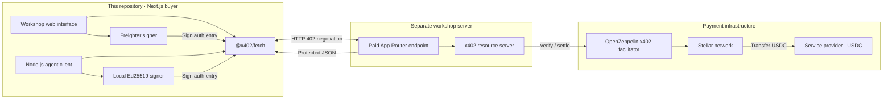
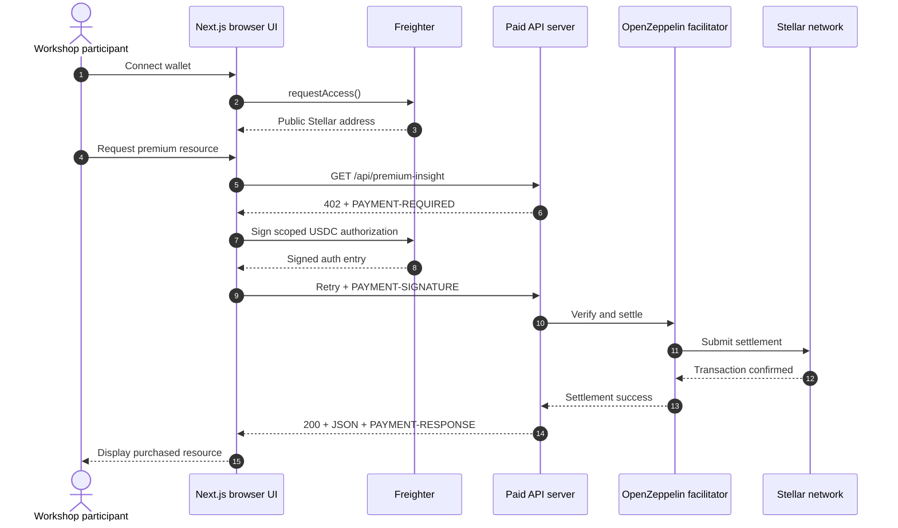
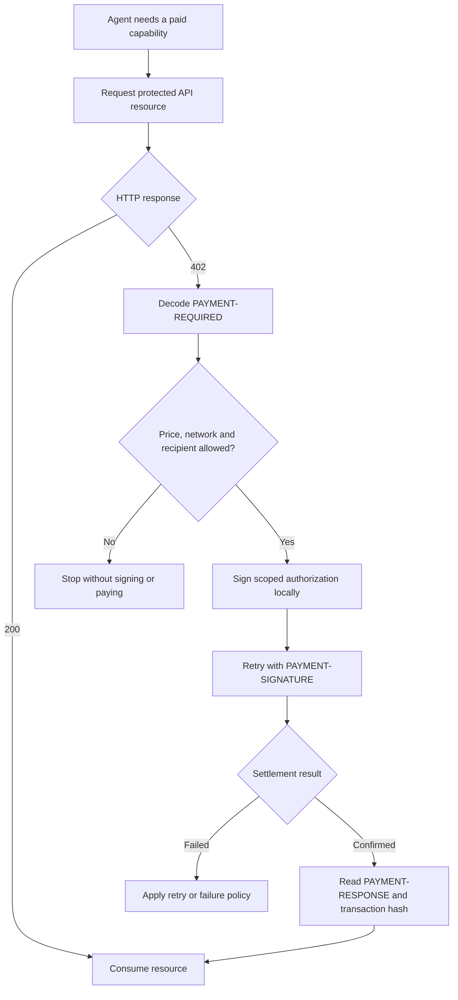

# Stellar x402 Workshop Client

Next.js App Router client for the separate
`stellar-x402-workshop-server`. It demonstrates the same paid API in two ways:

- Browser + Freighter for a visual workshop flow.
- A headless Node.js script representing an autonomous agent.

## Solution architecture

This repository is the **buyer application**. Both client modes use the same
x402 v2 negotiation and call the separately deployed workshop resource server.
They differ only in who controls the signer.



Browser code never receives a secret seed. The autonomous script reads its
Testnet seed from a local, gitignored environment file and signs inside the
Node.js process.

## Browser client process



## Autonomous agent process



The workshop script performs the signing and retry automatically. A production
agent should add explicit spending limits, recipient allowlists, idempotency and
retry policies before authorizing payments.

## Requirements

- Node.js 22 or newer
- The workshop server running locally or deployed
- Freighter browser extension configured for Stellar Testnet
- A funded Testnet account with USDC for real workshop payments

## Install Stellar CLI

Install the latest stable release. The official installation guide is
https://developers.stellar.org/docs/tools/cli/install-cli.

### macOS

With Homebrew:

```bash
brew install stellar-cli
```

If it is already installed, update it:

```bash
brew update
brew upgrade stellar-cli
```

Alternative official installer when Homebrew is unavailable:

```bash
curl -fsSL https://github.com/stellar/stellar-cli/raw/main/install.sh | sh
```

Open a new terminal if the installer changes `PATH`, then verify:

```bash
stellar --version
```

### Windows

Open PowerShell and install with Windows Package Manager:

```powershell
winget install --id Stellar.StellarCLI
```

If it is already installed, update it:

```powershell
winget upgrade --id Stellar.StellarCLI
```

Close and reopen PowerShell, then verify:

```powershell
stellar --version
```

If `winget` is unavailable, install a signed Windows binary from the official
releases page: https://github.com/stellar/stellar-cli/releases. Add the folder
containing `stellar.exe` to the user `PATH` and reopen PowerShell.

The commands below target current Stellar CLI 26+. Versions 23–25 used the
legacy `--global` option. Upgrade the CLI instead of adding that removed flag.

## Create and fund the Testnet wallets

The complete demo uses two different accounts:

- `workshop-receiver` receives USDC and is configured as server `PAY_TO`.
- `workshop-payer` holds USDC and signs through Freighter or the Node.js agent.

Confirm the tools first:

```bash
node --version
npm --version
stellar --version
```

Create and fund both accounts with Testnet XLM:

```text
stellar keys generate workshop-receiver --network testnet --fund --secure-store
stellar keys generate workshop-payer --network testnet --fund --secure-store
```

Print their public addresses:

```bash
stellar keys address workshop-receiver
stellar keys address workshop-payer
```

Both results must begin with `G`. If Friendbot funding needs to be repeated:

```bash
stellar keys fund workshop-receiver --network testnet
stellar keys fund workshop-payer --network testnet
```

Friendbot supplies Testnet XLM, not USDC. Establish the official Testnet USDC
trustline on both accounts:

```text
stellar tx new change-trust --network testnet --source-account workshop-receiver --line USDC:GBBD47IF6LWK7P7MDEVSCWR7DPUWV3NY3DTQEVFL4NAT4AQH3ZLLFLA5 --limit 1000000
stellar tx new change-trust --network testnet --source-account workshop-payer --line USDC:GBBD47IF6LWK7P7MDEVSCWR7DPUWV3NY3DTQEVFL4NAT4AQH3ZLLFLA5 --limit 1000000
```

These single-line commands work unchanged in macOS terminals and Windows
PowerShell.

Request Testnet USDC for the payer's public `G...` address at
https://faucet.circle.com. The payer must hold more than `0.001 USDC`; each
successful workshop request spends `0.001 USDC`.

## Import the payer into Freighter

1. Install the Freighter browser extension.
2. Select **Testnet** in Freighter.
3. Print the disposable payer's secret locally:

   ```bash
   stellar keys secret workshop-payer
   ```

4. Import the resulting `S...` secret into Freighter.
5. Confirm the wallet shows the payer's public address and Testnet USDC.

Never paste the secret into chat, documentation, screenshots or Git. Clear the
terminal after importing it. Freighter Mobile does not currently support this
x402 flow; use the browser extension.

## Prepare the separate server first

Before this client starts, configure the server with:

- `PAY_TO`: the public `G...` address of `workshop-receiver`;
- an API key from https://channels.openzeppelin.com/testnet/gen;
- `STELLAR_NETWORK=stellar:testnet`;
- `CLIENT_ORIGIN=http://localhost:3001`.

In the server repository run, in order:

```bash
npm ci
npm run setup
npm run preflight
npm run check
npm run dev
```

Keep the server running on http://localhost:3000. In another server terminal,
run `npm run test:paywall` and confirm the response is `402` before starting
this client.

## Quickstart for the browser flow

The server must already be running on http://localhost:3000. Then run:

```bash
npm ci
npm run setup
npm run preflight
npm run check
npm run dev
```

`npm run setup` creates `.env.local` without overwriting an existing file. The
browser configuration should be:

```dotenv
NEXT_PUBLIC_API_URL=http://localhost:3000
NEXT_PUBLIC_STELLAR_NETWORK=stellar:testnet
```

Open http://localhost:3001 and follow the buttons in order:

The client terminal prints a safe trace that can be shown during the workshop:

```text
[x402 client][a1b2c3d4] 1 · UNPAID API REQUEST SENT | api=http://localhost:3000
[x402 client][a1b2c3d4] 2 · HTTP 402 · PAYMENT REQUIRED RECEIVED | status=402 | price=$0.001 USDC
[x402 client][e5f6g7h8] 1 · X402 PAYMENT FLOW STARTED | price=$0.001 USDC | network=stellar:testnet
[x402 client][e5f6g7h8] 2 · WALLET AUTHORIZATION REQUESTED | wallet=GABCDE…WXYZ
[x402 client][e5f6g7h8] 3 · WALLET AUTHORIZATION APPROVED | wallet=GABCDE…WXYZ
[x402 client][e5f6g7h8] 4 · PAYMENT RESPONSE RECEIVED | status=200 | facilitator=OpenZeppelin
```

The same events remain visible in Chrome DevTools. Signed authorization data,
private keys and encoded payment headers are never logged.

1. **Conectar Freighter** — confirm the displayed account is the funded Testnet
   account.
2. **Ver respuesta 402** — expected message: `402 recibido` and a visible
   `PAYMENT-REQUIRED` payload.
3. **Pagar $0.001 USDC** — review and authorize the scoped payment in Freighter.

The successful result is status `200`, the protected JSON and
`PAYMENT-RESPONSE: recibido`. The first `402` is expected; it is the quotation,
not an application failure.

## Autonomous agent flow

The optional Node.js agent uses the same server and protocol without a browser.
Add a dedicated, minimally funded Testnet account secret to `.env.local`:

```dotenv
STELLAR_PRIVATE_KEY=S_YOUR_TESTNET_SECRET
```

Then run:

```bash
npm run preflight:agent
npm run agent:wallet
npm run agent:pay
```

`agent:wallet` prints the agent's public address, network, official USDC
trustline status, USDC balance and network fee balance. Use the public address
to fund the disposable Testnet agent wallet; the secret is never printed.

`agent:pay` first demonstrates the unpaid `402` challenge, then signs and
retries autonomously without Freighter or human approval.

Expected output includes:

```text
[x402 agent] 1 · AGENT WALLET LOADED | payer=GABCDE…WXYZ | network=stellar:testnet
[x402 agent] 2 · UNPAID REQUEST SENT | api=http://localhost:3000
[x402 agent] 3 · HTTP 402 · PAYMENT REQUIRED RECEIVED | price=$0.001 USDC
[x402 agent] 4 · AUTONOMOUS PAYMENT AUTHORIZATION STARTED | signer=local agent wallet
[x402 agent] 5 · PAYMENT RESPONSE RECEIVED | status=200 | settlement=true
[x402 agent] 6 · PAYMENT SETTLED | success=true | network=stellar:testnet
[x402 agent] 7 · STELLAR TRANSACTION CONFIRMED | hash=...
[x402 agent] 8 · PROTECTED RESOURCE DELIVERED | body=...
```

The script loads `.env.local` directly. Never commit the secret, paste it into
terminal output, or put it in a `NEXT_PUBLIC_*` variable.

## Complete execution order

1. Create `workshop-receiver` and `workshop-payer`.
2. Fund both with Testnet XLM.
3. Establish the USDC trustline on both.
4. Request Testnet USDC for `workshop-payer`.
5. Configure and start the server on port `3000`.
6. Verify the server returns `402` with `npm run test:paywall`.
7. Configure and start this client on port `3001`.
8. Connect the funded payer through Freighter on Testnet.
9. Inspect `402`, authorize `0.001 USDC`, then confirm `200` and
   `PAYMENT-RESPONSE`.
10. Optionally run `npm run preflight:agent` and `npm run agent`.

## Command reference

| Command | Purpose |
| --- | --- |
| `npm run setup` | Create `.env.local` without overwriting an existing file |
| `npm run preflight` | Validate browser/Testnet configuration |
| `npm run preflight:agent` | Also validate the private Testnet signer without printing it |
| `npm run dev` | Show the workshop banner and run the browser client on port 3001 |
| `npm run agent:wallet` | Show the agent public wallet and current USDC readiness |
| `npm run agent:pay` | Execute one autonomous paid x402 request |
| `npm run agent` | Backward-compatible alias for `agent:pay` |
| `npm run check` | Run lint, unit tests and production build |

## Troubleshooting

- `Instala la extensión Freighter`: use the desktop browser extension and
  reload the page after installation.
- Wallet is on the wrong network: select Testnet in Freighter before connecting.
- `402 recibido` but payment fails: confirm the payer has Testnet USDC and the
  server uses `stellar:testnet`.
- CORS error: server `CLIENT_ORIGIN` must be `http://localhost:3001` locally.
- `EADDRINUSE` on port `3001`: another client is already running. Find it with
  `lsof -nP -iTCP:3001 -sTCP:LISTEN`, return to its terminal, and stop it with
  `Ctrl+C`. Keep the new client visible in this terminal during the workshop;
  when finished, press `Ctrl+C` and wait for the shell prompt.
- `STELLAR_PRIVATE_KEY is required`: this affects only `npm run agent`; the
  browser flow signs with Freighter and does not need the secret.
- Never use Mainnet funds for the workshop test.

## Mainnet

The client supports `stellar:pubnet`, but workshop tests use Testnet. For a real
deployment, the client and server must use the same network:

```dotenv
NEXT_PUBLIC_STELLAR_NETWORK=stellar:pubnet
NEXT_PUBLIC_API_URL=https://your-mainnet-server.example
```

Mainnet payments move real USDC. Review prices, recipients, and environment
variables before enabling them.

## Vercel

Import this repository separately, set `NEXT_PUBLIC_API_URL` to the deployed
server URL, and set `NEXT_PUBLIC_STELLAR_NETWORK`. The local agent script is not
part of the Vercel deployment.

## Official references

- https://developers.stellar.org/docs/build/agentic-payments/x402
- https://developers.stellar.org/docs/build/agentic-payments/x402/built-on-stellar
- https://docs.x402.org/core-concepts/http-402
