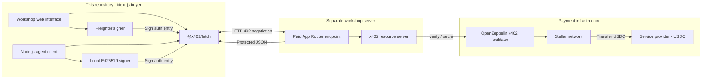
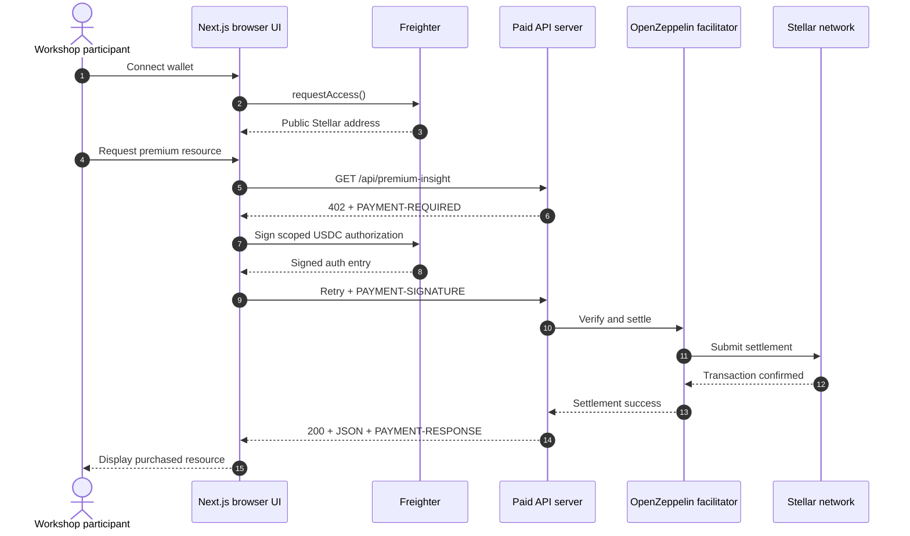
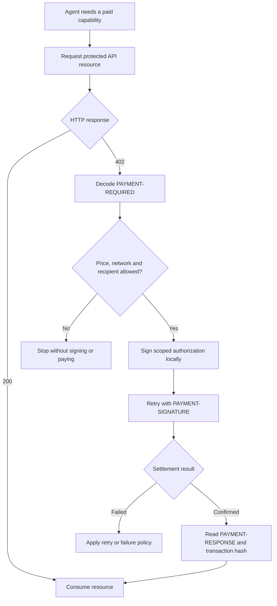

# Stellar x402 Workshop Client

Next.js App Router client for the separate
`stellar-x402-workshop-server`. It demonstrates the same paid API in two ways:

- Browser + Freighter for a visual workshop flow.
- A headless Node.js script representing an autonomous agent.

## Solution architecture

This repository is the **buyer application**. Both client modes use the same
x402 v2 negotiation and call the separately deployed workshop resource server.
They differ only in who controls the signer.



Browser code never receives a secret seed. The autonomous script reads its
Testnet seed from a local, gitignored environment file and signs inside the
Node.js process.

## Browser client process



## Autonomous agent process



The workshop script performs the signing and retry automatically. A production
agent should add explicit spending limits, recipient allowlists, idempotency and
retry policies before authorizing payments.

## Requirements

- Node.js 22+
- The workshop server running locally or deployed
- Freighter browser extension for the visual flow
- Testnet USDC for real workshop payments

## Browser flow

```bash
cp .env.example .env.local
npm ci
npm run dev
```

Open http://localhost:3001. Configure Freighter for Testnet, connect, inspect
the 402 response, then authorize the `$0.001 USDC` payment.

## Autonomous agent flow

Add a dedicated Testnet account secret to `.env.local`:

```dotenv
STELLAR_PRIVATE_KEY=S_YOUR_TESTNET_SECRET
```

Then run:

```bash
npm run agent
```

Use a disposable workshop account with a minimal balance. Never commit its
secret and never put it in a `NEXT_PUBLIC_` variable.

## Mainnet

The client supports `stellar:pubnet`, but workshop tests use Testnet. For a real
deployment, the client and server must use the same network:

```dotenv
NEXT_PUBLIC_STELLAR_NETWORK=stellar:pubnet
NEXT_PUBLIC_API_URL=https://your-mainnet-server.example
```

Mainnet payments move real USDC. Review prices, recipients, and environment
variables before enabling them.

## Vercel

Import this repository separately, set `NEXT_PUBLIC_API_URL` to the deployed
server URL, and set `NEXT_PUBLIC_STELLAR_NETWORK`. The local agent script is not
part of the Vercel deployment.

## Validation

```bash
npm run check
```

## Official references

- https://developers.stellar.org/docs/build/agentic-payments/x402
- https://developers.stellar.org/docs/build/agentic-payments/x402/built-on-stellar
- https://docs.x402.org/core-concepts/http-402
